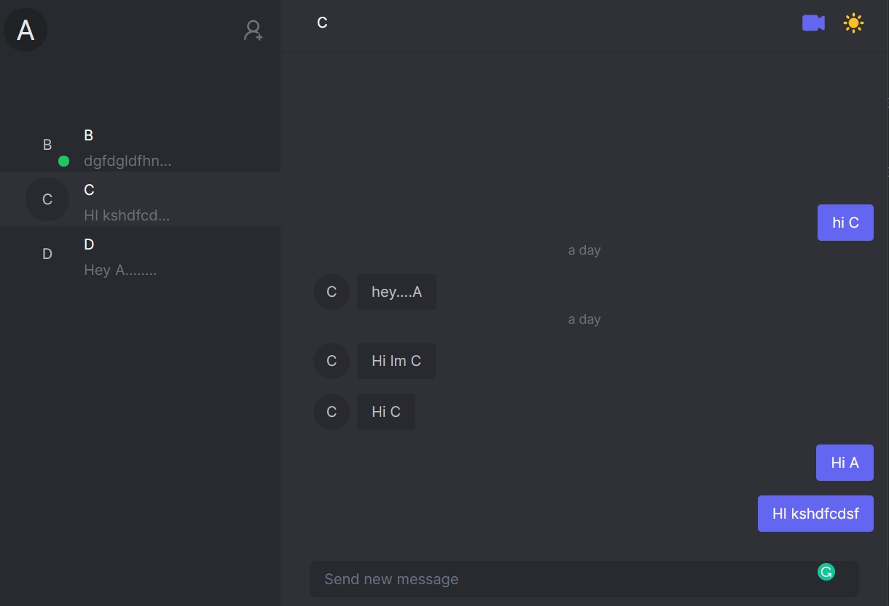

<p align="center">
  <a href="http://nestjs.com/" target="blank"></a>
</p>

## Start Development

### requirements

- `node.js`
- `PostgreSQL`
- `npm`
- `yarn`

```bash
npm install --global yarn
```

### NestJS Server

```bash
git cl https://github.com/dev-SR/webrtc-websocket-reactts-nestjs-chat-app.git
cd webrtc-websocket-reactts-nestjs-chat-app
code .
yarn
yarn start:dev
```

### React Client

```bash
cd frontend
code .
yarn
yarn dev
```

> Don't forget to start `backend server` before  `frontend server` as frontend requires proxy server

## Heroku Deployment

For deployment we will serve `static` version of frontend as `SPA`(Single Page Application) from Backend server
rather than separate hosting frontend on separate server.

```typescript
@Module({
  imports: [
    //....
    ServeStaticModule.forRoot({
      rootPath: join(__dirname, '..', 'frontend', 'build'),
      exclude: ['/api*'],
    }),
    //...
  ],
  controllers: [AppController],
  providers: [AppService],
})
export class AppModule {}
```

### Building static frontend pages

After building server on heroku we also need to ...build frontend

```json
"scripts": {
    "client:build": "yarn --cwd frontend install && yarn --cwd frontend build"
  },
```

This command means go to `frontend` dir then ...`install` and `build`

```bash
yarn --cwd <path> <yarn command>.
```

### Skip pruning (IMPORTANT)🚀🚀🚀


If you need access to packages declared under `devDependencies` in a different buildpack or at runtime, then you can set `NPM_CONFIG_PRODUCTION=false or YARN_PRODUCTION=false`to skip the pruning step.

[https://devcenter.heroku.com/articles/nodejs-support](https://devcenter.heroku.com/articles/nodejs-support)

```bash
heroku config:set NPM_CONFIG_PRODUCTION=false YARN_PRODUCTION=false
```

or

```json
"scripts": {
    "prebuild": "rimraf dist",
    "build": "nest build && yarn client:build",
    "start:dev": "nest start --watch",
    "start:prod": "node dist/main",
    "client:build": "NPM_CONFIG_PRODUCTION=false YARN_PRODUCTION=false yarn --cwd frontend install && yarn --cwd frontend build"
  },
```

### Creating a Heroku remote

```powershell
git branch -M main
heroku create -a dev-sr-chat-backend
git remote -v
heroku features:enable http-session-affinity // 🚀 Enable Websocket 🚀
git push heroku main
# git subtree push --prefix server heroku master
 heroku logs --tail
```

### For an existing Heroku app

```powershell
git branch -M main
heroku git:remote -a dev-sr-chat-backend
heroku features:enable http-session-affinity // Enable Websocket
git push heroku main
# git subtree push --prefix server heroku master
```

> Heroku says : Cannot find module 'socket.io'

```powershell
yarn add @nestjs/websockets @nestjs/platform-socket.io
yarn add socket.io @types/socket.io
```


### Specifying a Yarn Version (OP)

If a `yarn.lock` file is found at the root of your application along with package.json, H**eroku will download and install Yarn and use it to install your dependencies**. However, you should specify which version you are using locally so that same version can be used on Heroku.


```bash
{
  "name": "myapp",
  "description": "a really cool app",
  "version": "1.0.0",
  "engines": {
    "yarn": "1.x"
  }
}
```


## DON'T FORGET TO CHANGE socket.io-client connection options (IMPORTANT)🚀🚀🚀

[in here](https://github.com/dev-SR/webrtc-websocket-reactts-nestjs-chat-app/blob/main/frontend/src/context/SocketProvider.tsx)


```javascript
//CHANGE io options

// IN development mode
 const s: Socket = io('http://localhost:5000', { withCredentials: true }); //because of DIFF. DOMAINS

// IN production mode
 const s: Socket = io({ withCredentials: true }); //UNDER SAME DOMAIN
```

